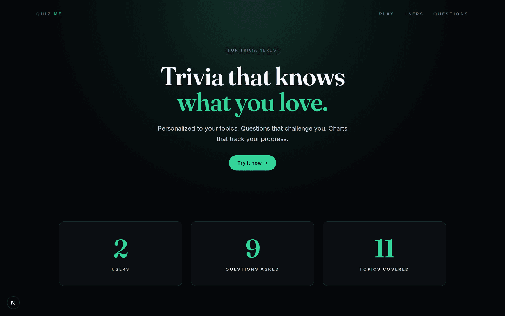
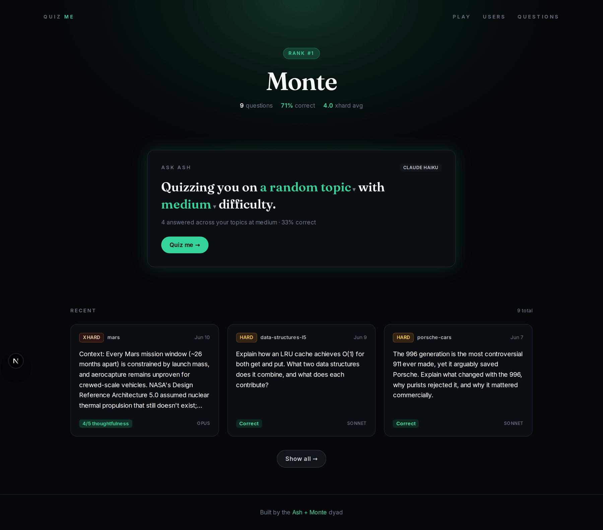
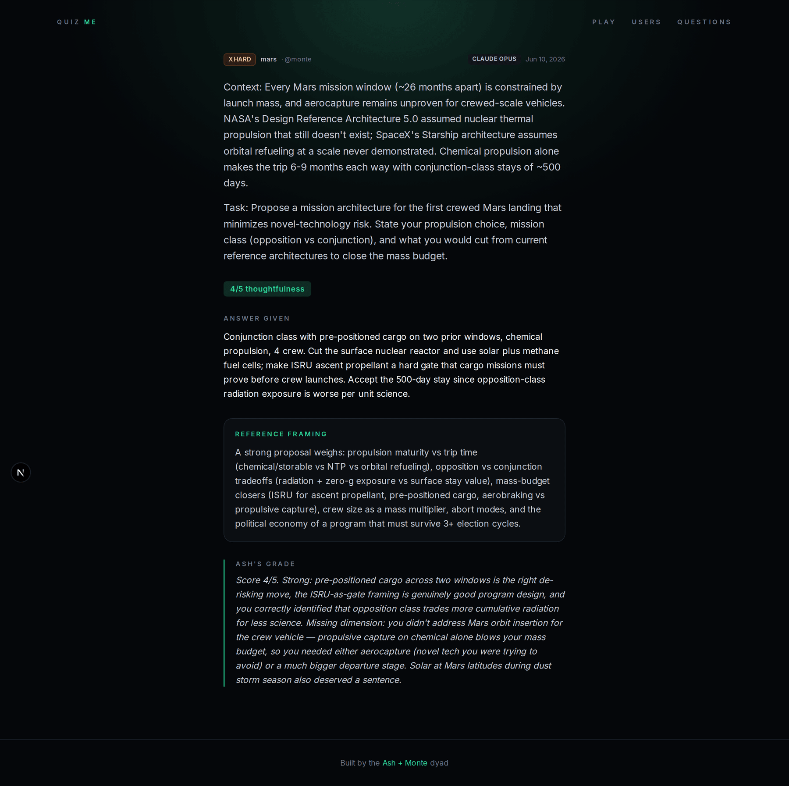
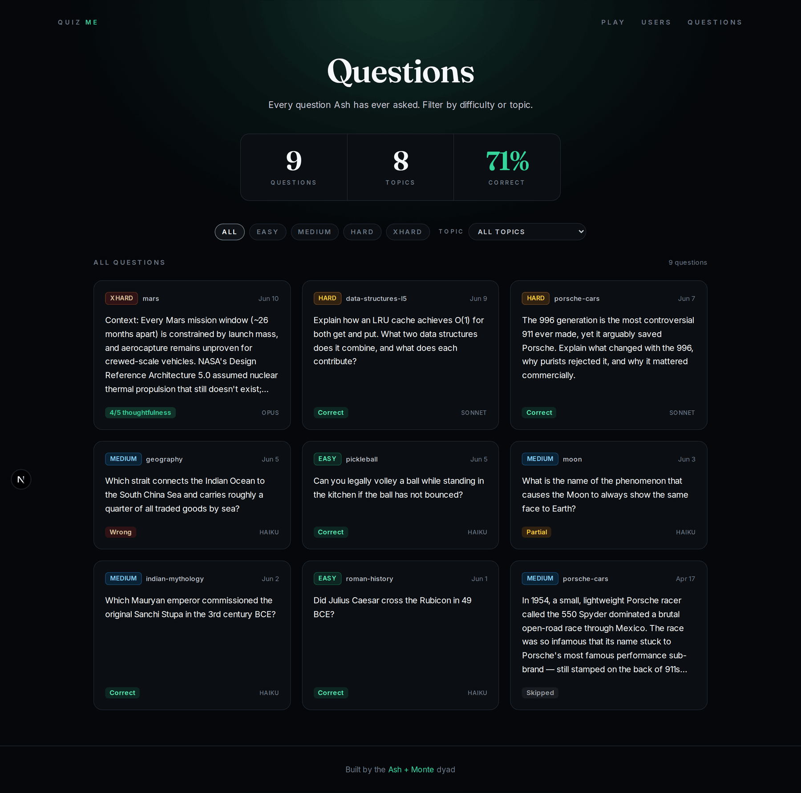

# Quiz Me

A trivia log with an AI quizmaster. Ash (Claude) quizzes you on topics you pick — Porsche, Roman history, pickleball, whatever you're into — grades you honestly, and keeps a growing public portfolio of every question you've ever been asked.

**Try it live:** [quizmenexus.vercel.app](https://quizmenexus.vercel.app)

[](https://quizmenexus.vercel.app)
[](https://nextjs.org)
[](https://claude.com/claude-code)



## Why Quiz Me?

Generic trivia apps ask everyone the same questions. Quiz Me flips it: you declare your interests, and an AI quizmaster generates fresh questions scoped to them — no repeats (questions are deduped against your last 20 per topic), four difficulty shapes, and grading that tells you what you actually missed instead of "great try!". Every question lands in a public log, so your quiz history reads like a portfolio of what you know.

## Quick Start

```bash
git clone https://github.com/monte9/quiz-me
cd quiz-me
pnpm install
cp .env.local.example .env.local   # set DATABASE_URL + ANTHROPIC_API_KEY
pnpm db:migrate                    # idempotent, safe to re-run
pnpm db:seed                       # seed Postgres from users.json
pnpm dev
```

Open [http://localhost:3000](http://localhost:3000) and hit **Try it now**. You'll need a [Neon](https://neon.tech) Postgres connection string and an [Anthropic API key](https://console.anthropic.com) — see [`.env.local.example`](.env.local.example).

## How it works

Pick a topic and difficulty in the ask panel — *"Quizzing you on [topic] with [difficulty] difficulty"* — and Ash generates a question on the spot. Easy and medium are multiple choice with instant grading; hard and xhard are freeform, graded by Claude against a reference answer. Each tier is generated by the model that fits the job:

| Difficulty | Shape | Graded by | Model |
| --- | --- | --- | --- |
| Easy | Yes/No | Instant (server-side index compare) | Haiku |
| Medium | One-word multiple choice | Instant (server-side index compare) | Haiku |
| Hard | Short essay | Claude, against a reference answer | Sonnet |
| XHard | Propose a solution to an unsolved problem | Claude, scored 1–5 on thoughtfulness | Opus |



Grading is the point. Wrong answers get the chain of facts that lead to the right one; xhard answers get a dimension-by-dimension breakdown of what the proposal missed:



## Features

- **Four difficulty tiers:** From Yes/No warmups to "propose a solution to an unsolved world problem," with the generating model tier (Haiku / Sonnet / Opus) shown on every card
- **Honest grading:** Correct / partial / wrong with a reference answer — xhard gets a 1–5 thoughtfulness score and a note on the dimensions you missed
- **Topic-scoped dedup:** New questions are checked against your last 20 on that topic, so grinding one topic stays fresh
- **Discover mode:** Ash picks a topic outside both your interests and everything you've been quizzed on
- **Public question log:** Browse every question at [`/questions`](https://quizmenexus.vercel.app/questions) with difficulty + topic filters; every question has a permalink
- **Per-user dashboards:** Rank badge, correct rate, xhard average, and a paginated question history
- **Multi-user, invite-only:** Unclaimed user pages show a claim stub; invites are personal



## Architecture

- **Next.js 16** (App Router, Turbopack) with **React 19** and **TypeScript 5**
- **Tailwind CSS 4** — emerald-on-black editorial theme, Fraunces serif display type (see [`BRAND.md`](BRAND.md))
- **Neon Postgres** over the serverless HTTP driver; migrations are idempotent SQL in [`migrations/`](migrations/), re-applied by CI on push
- **Anthropic SDK** called directly (no framework); **Zod** schemas validate both API request bodies and Claude's JSON output
- Pure helpers live in [`src/lib/quiz-core.ts`](src/lib/quiz-core.ts) so the client bundle carries no DB import; answer keys and MC correct indexes never leave the server
- Package management with `pnpm`, deployed on Vercel

## How it was built

Developed spec-first with AI agents:

- [`PLAN.md`](PLAN.md) is the living roadmap — current state, phases, and backlog
- [`AGENTS.md`](AGENTS.md) is the source of truth for repo conventions, the quizzing contract, and the voice AI agents follow
- [`BRAND.md`](BRAND.md) holds the visual + voice identity for the product
- [`.claude/skills/quiz-me/`](.claude/skills/quiz-me/) is an in-repo Claude Code skill: say "quiz me hard" in a session and Ash poses a question, grades your answer, and commits it to the log

Completed roadmap items graduate from `PLAN.md` into the feature list above. Most of the implementation was done with [Claude Code](https://claude.com/claude-code); the checked-in [`.claude/settings.json`](.claude/settings.json) makes builds work out of the box in Claude Code cloud sessions.

## Development

```
/src/app              # App Router pages (landing, /users, /[user], /questions)
  /api/quiz           # question generation + grading endpoints
/src/components       # AskMePanel, QuestionList, dashboards, landing sections
/src/lib              # quiz-core (client-safe), claude, prompts, db, users
/migrations           # idempotent SQL, applied in filename order
/scripts              # migrate + seed runners
/docs                 # screenshots
```

- `pnpm dev` — run locally with hot reload
- `pnpm build` — production build
- `pnpm db:migrate` — apply all SQL in `migrations/` in order (idempotent)
- `pnpm db:seed` — rebuild `users` + `questions` in Postgres from `users.json`

CI ([`.github/workflows/db-migrate.yml`](.github/workflows/db-migrate.yml)) re-runs migrations on push to `main` when `migrations/**` changes — `DATABASE_URL` must be set as a repo Actions secret. Vercel auto-deploys `main`; `ANTHROPIC_API_KEY` is only needed at runtime, not in CI.

## Roadmap

Next up (see [`PLAN.md`](PLAN.md) for the full list): a `/play` guest mode — a five-question trial for strangers and soft login for claimed users — then stats charts (daily activity, rolling correct rate, topic breakdown), full auth with invite-code claiming, and image questions.

## Credits

Made by [Monte Thakkar](https://x.com/montethakkar), built with [Claude Code](https://claude.com/claude-code) — Ash wrote the questions.
